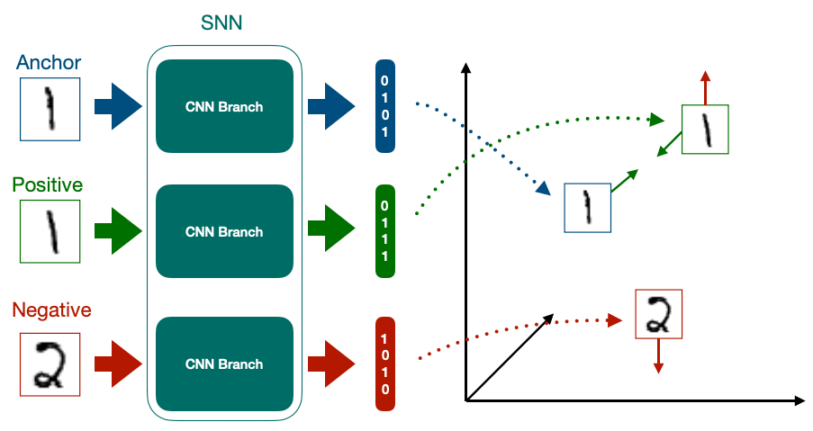
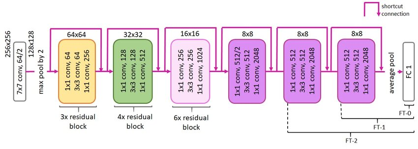
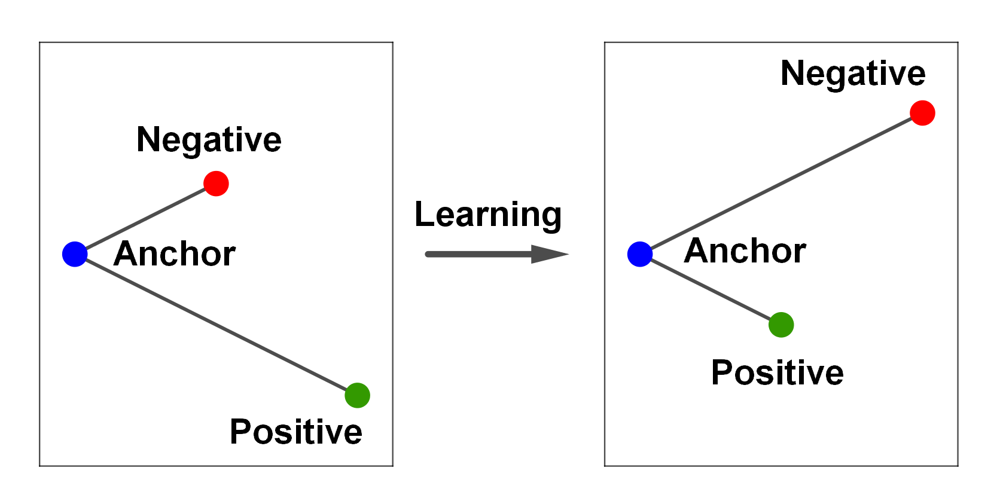
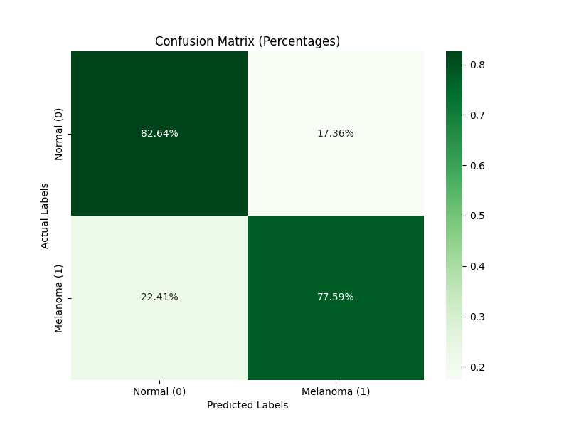
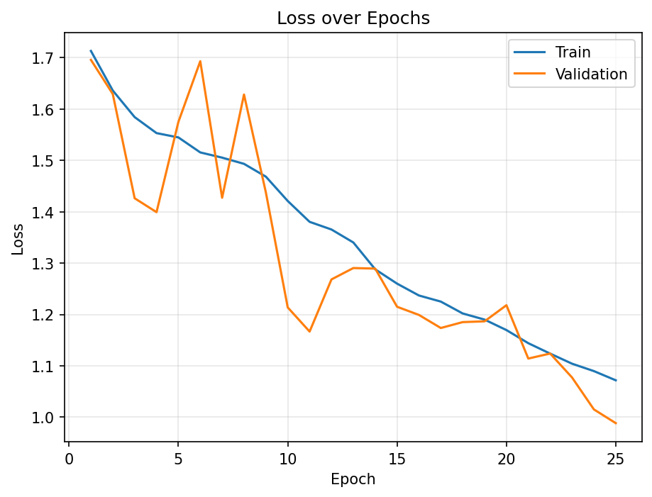
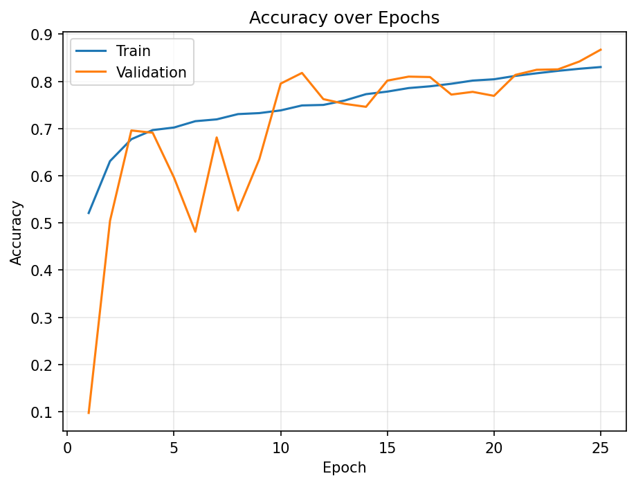
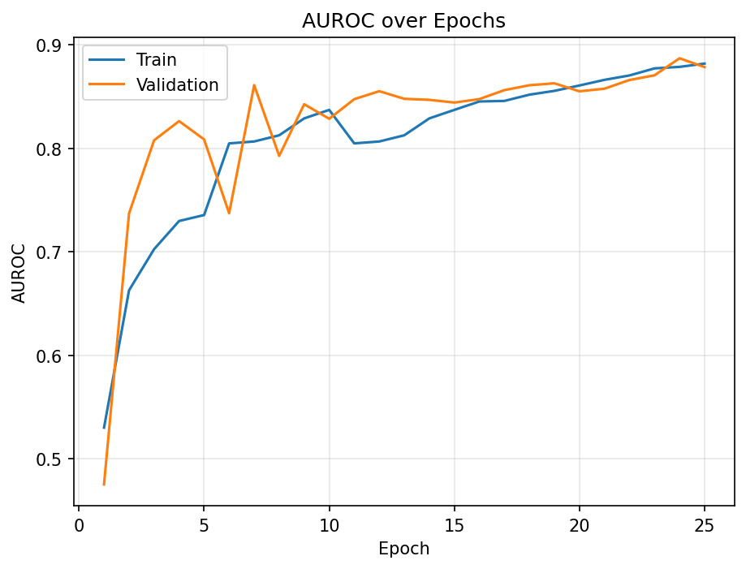
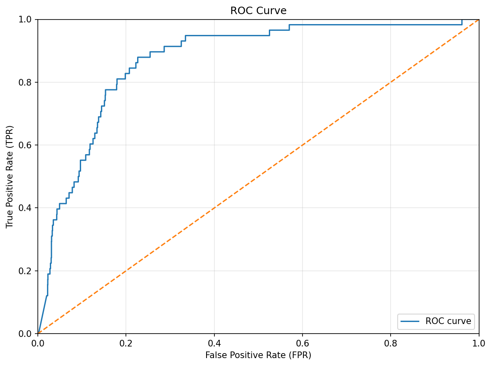
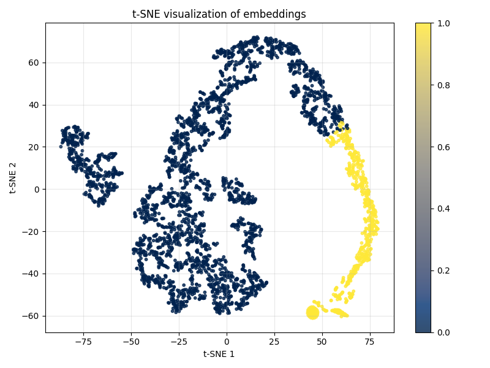

# Siamese network for Classification of ISIC 2020 Data Set (Project 9)

### Student Name: Ba Kiet Nguyen

### Student ID: 49061729

## Overview

This project aims to create a classifier based on Siamese network to classify the ISIC 2020 Kaggle Challenge data set (normal and melanoma) having an accuracy of around 0.8 on the test set.

Because the dataset is extremely imbalanced (1.8% melanoma vs 98.2% benign), plain accuracy is misleading, a trivial classifier that always predicts “benign” reaches 98.2% while learning nothing about melanomas

Therefore we evaluate the model using AUC-ROC, which balances sensitivity (TPR) and specificity (TNR) and considers both classes. AUC-ROC is standard for imbalanced medical-imaging tasks. Accordingly, our goal is to maximize AUC-ROC on the test set.

Also, this model is trained on Google Collab for faster training and larger GPU ram. Since my laptop does not have enough GPU ram.

## Environment Setup

### 1. Downloading the data

- Download the data from https://www.kaggle.com/datasets/nischaydnk/isic-2020-jpg-256x256-resized

### 2. Install Anaconda or Miniconda

- Download and install Anaconda or Miniconda for your OS

### 3. CUDA Toolkit 11.8 Installation (for NVIDIA GPU)

- Download from NVIDIA CUDA Toolkit Archive (`https://developer.nvidia.com/cuda-toolkit-archive`)
- Choose CUDA Toolkit 11.8.0
- Follow OS-specific installation guide
- Verify with `nvidia-smi`

### 4. Environment Creation

```bash
conda create -n isic-env python=3.8.19 -y
conda activate isic-env
```

### 5. Package Installation

```bash
# PyTorch with CUDA 11.8
conda install pytorch=2.1.1 torchvision=0.16.1 torchaudio pytorch-cuda=11.8 -c pytorch -c nvidia -y

# Core libraries
conda install scikit-learn=1.3.2 matplotlib=3.7.2 seaborn=0.13.2 tqdm=4.66.5 pillow=10.4.0 pandas=2.0.3 numpy=1.24.3 -y
```

#### This installs

- Python: 3.8.19
- PyTorch: 2.1.1 (CUDA 11.8 support)
- torchvision: 0.16.1
- CUDA Toolkit: 11.8
- scikit-learn: 1.3.2
- matplotlib: 3.7.2
- seaborn: 0.13.2
- tqdm: 4.66.5
- Pillow (PIL): 10.4.0
- pandas: 2.0.3
- numpy: 1.24.3

### 6. Run the program

```
python3 train.py
```

## Dataset Overview

- Source: ISIC 2020 Challenge Dataset (256x256 Resized version)
- Link: https://www.kaggle.com/datasets/nischaydnk/isic-2020-jpg-256x256-resized
- Details:
  - Image dimensions: 256x256 pixels.
  - Classes: 0 for Benign and 1 for Malignant.
  - Total images: 33,126
  - CSV file: Contains image IDs, labels, and patient id.

## Data Preparation

### Handle Imbalance Dataset

Since the dataset is extremely imbalance (1.8% melanoma vs 98.2% benign). On the train set, the minority class (melanoma) will be oversampled until the class distribution is 50:50.

### Data Augmentation

For train set:

- `RandomCrop(size=(224, 224))` Randomly crops a 224×224 window from the image.
- `RandomHorizontalFlip(p=0.5)` Flips left to right or right to left with 50% probability.
- `RandomVerticalFlip(p=0.5)` Flips top to bottom or bottom to top with 50% probability.
- `RandomRotation(degrees=10)` Rotates by a random angle in the range [-10, +10] degree.
- `ColorJitter(brightness=0.2, contrast=0.2, saturation=0.2, hue=0.1)`
  Randomly adjusts the image’s brightness, contrast, saturation, and hue to create slight visual variation.

These data augmentations will expand dataset diversity and reduce overfitting and improve generalization.

### Data Normalization:

We normalize images to ResNet-50’s ImageNet pretraining stats:

- Mean [0.485, 0.456, 0.406]
- Standard deviation [0.229, 0.224, 0.225]

### Triplet sampling

- Generate (anchor, positive, negative) by pairing the anchor with a same-class positive and a different-class negative

### Data splitting

- Applying 80/10/10 split for train/validation/test, intentionally keeping the validation and test sets small to maximize training data and improve model performance. I have tried with smaller size of training set, but the result was not as good as 80/10/10.
- Details of classes in dataset.

  |       | Normal | Melanoma |
  | :---- | :----: | :------: |
  | Train | 26033  |   467    |
  | Val   |  3255  |    58    |
  | Test  |  3254  |    59    |

## Siamese Model

### Model Overview

In the Siamese network, we take two images and pass them through the same network to get the feature embedding for the corresponding image. Then we compare the feature embeddings, if they are from the same class they should have similar embeddings. If images from two different classes then the embeddings should be far away. In this project, triplet loss is used to compute the loss for a pair of data samples.



In this project, the Siamese model uses a ResNet-50 backbone as a shared feature extractor to turn each image into a embedding. During training, it takes triplets of images - an anchor image, a positive image from the same class, and a negative image from a different class and learns to pull the anchor close to the positive and push it away from the negative using a triplet loss. On top of the embedding, there is a classifier which will predict the class (normal vs melanoma).

### Model Architecture

#### Feature Extractor



- The model uses `ResNet50` backbone with the last fully connected layer FC1 is replaced.
- Feature extractor will output 2048-dimensional vector.

#### Fully Connected Layers

- The last fully connected layer, FC1 of resnet50 is replaced by a custom fully connected layers. The layers are as follows:

  Linear(2048 -> 1024) -> ReLU -> Dropout(0.5) -> Linear(1024 -> 512) -> ReLU -> Dropout(0.5) -> Linear(512 -> 256) -> ReLU -> Dropout(0.5) -> Linear(256 -> embedding_dim).

#### Classifier

- The projection head produces embedding_dim-dimensional embeddings, which feed into a Linear(embedding_dim -> 2) classifier for the final prediction.

## Loss Function

### Triplet Loss



For this model, we implement TripletLoss loss function. Tripletloss will take each triplet output and will calculate the loss via the following formula:

`Loss = max(0, f(A,P) - f(A,N) + margin)` Where A = Anchor embedding, P = Positive embedding, N = Negative embedding, f = function that calculate Euclidean distance

During training, we want the anchor close to the positive and make it far away from the negative.

### Classifier Loss

Since there are 2 unit output from the classifier, The CrossEntropyLoss will used as the loss function for the classifier.

### Total Loss

We train the model with two goals at once: learn a good feature space and make correct class predictions. Triplet loss shapes the embedding space by pulling images of the same class closer together and pushing different classes apart, so features become more discriminative. Classifier loss will try map those features to the right labels. By summing these two losses together, the backbone learns features that are both well separated and useful for classification, which usually leads to better accuracy and more robust decision boundaries.

## Training Process

### Traning Details

- Epochs: 25.
- Train batch size: 32.
- Optimizer: Adam.
- Initial learning rate: 0.001
- Embedding dimension for Siamese network: 300.
- Learning rate scheduler: ReduceLROnPlateau.
- Using mixed precision: Running some operations in float16/float8 and the rest in float32 to speed up training and use less GPU memory while keeping similar accuracy.
- Using gradient clipping prevents exploding gradients by capping their size before the optimizer step.
- Save model with better auc roc score at every epoch.

### Evaluation Details

#### 1. Testing accuracy

- This is the accuracy of the model on the testset.

#### 2. Testing AUC ROC (Area Under the Receiver Operating Characteristic Curve)

- This is the primary evaluation metric for the model. Because the dataset is extremely imbalanced (1.8% melanoma vs 98.2% benign). Therefore we evaluate the model using AUC-ROC, which balances sensitivity (TPR) and specificity (TNR) and considers both classes.

- It measures how well the model separates classes across all thresholds. It is robust to class imbalance, summarizes the full sensitivity–specificity trade-off in one number.

#### 3. Confusion Matrix

- Visualize representative examples of: true positives (malignant correctly classified), true negatives (benign correctly classified), false positives (benign misclassified as malignant), and false negatives (malignant misclassified as benign).
- A confusion matrix shows how many examples were correctly and incorrectly classified for each class, making it easy to spot false positives and false negatives.

#### 4. Training Figures: Training / Validation loss, accuracy and AUC ROC over the training epochs

- Line plots per epoch: loss decrease, accuracy increase, and AUC increase for both training and validation.
- Annotate learning-rate schedule changes and saved checkpoints
- Find out overfitting signals (e.g., widening train–val gap) and final selected model checkpoint.

#### 5. Testing ROC Curve

- It represents the trade-off between the sensitivity and specificity of a classifier. Which is useful under class imbalance.

#### 6. Testing t-SNE Embedding Visualization

- It plot 2D t-SNE of the model’s embeddings to see how images cluster by class.

## Training Results

### 1. Testing accuracy

```
0.8255358
```

The model shows strong performance on the test set, above the 0.80 threshold.

### 2. Testing AUC ROC (Area Under the Receiver Operating Characteristic Curve)

```
0.8707
```

The AUC ROC score in above 0.8 indicates that the model effectively distinguishes between positive and negative instances in the case of the dataset imbalance.

### 3. Confusion Matrix



It is clear to see that Testing Specificity (true negative rate)

```
0.8264
```

This means the model performs well at predicting true normal skin as normal.

For the Testing Sensitivity.

```
0.7759
```

Given the test set has only 59 melanoma cases, the model still identifies melanomas reliably, achieving 0.7759 (around 0.8) and consistent with our target.

### 4. Training Figures: Training / Validation loss, accuracy and AUC ROC over the training epochs

|  |  |  |
| ----------------------------------------------- | --------------------------------------------------- | ------------------------------------------------ |

- Training and validation curves track closely without divergence or a validation plateau, suggesting minimal overfitting.
- Steady decrease in loss for both training and validation sets.
- The accuracy and AUC-ROC score increase over epochs in both training and validation sets. The accuracy and AUC-ROc rate slow down later, but the model still able to achieve more than 0.8 on auc roc score

### 5. Testing ROC Curve

- AUC ROC score 0.8707 showing strong discrimination; the model separates melanoma vs benign well.



### 6. Testing t-SNE Embedding Visualization

- t-SNE shows two well-separated clusters (yellow vs dark blue), indicating the embeddings are strongly discriminative between the two classes.
- There is partial overlap. This means some samples are uncertain or share similar features.



## References

1. ISIC 2020 Challenge: https://www.kaggle.com/datasets/nischaydnk/isic-2020-jpg-256x256-resized/code
2. Shakes. (2024). https://github.com/shakes76/PatternAnalysis-2024
3. GeeksforGeeks. (2025, August 4). AUC ROC Curve in Machine Learning. https://www.geeksforgeeks.org/machine-learning/auc-roc-curve/
4. Nag, R. (2022, November 19). A comprehensive guide to Siamese neural networks. Medium. https://medium.com/@rinkinag24/a-comprehensive-guide-to-siamese-neural-networks-3358658c0513
5. Brata, M., & Zakia, I. (2024). ResNet-50 architecture for regression [Figure]. In Path Loss Estimation at Sub-6 GHz and Millimeter Wave Frequencies Using Fine-Tuning. ResearchGate. https://www.researchgate.net/figure/ResNet-50-architecture-for-regression_fig4_384281904
6. TorchVision Team. (2025). resnet50 — Torchvision main documentation. PyTorch. https://docs.pytorch.org/vision/main/models/generated/torchvision.models.resnet50.html
7. Hey, A. (2024, November 3). Guide to gradient clipping in PyTorch. Biased-Algorithms (Medium). https://medium.com/biased-algorithms/guide-to-gradient-clipping-in-pytorch-f1db24ea08a2
8. GeeksforGeeks. (2025, June 18). What is Mixed Precision Training? https://www.geeksforgeeks.org/deep-learning/what-is-mixed-precision-training/
